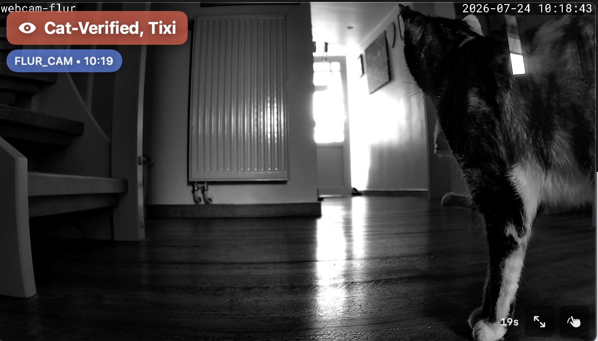
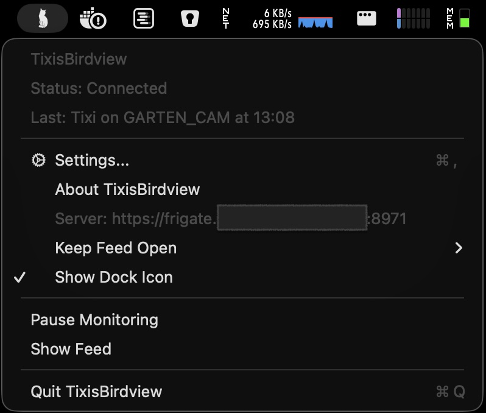
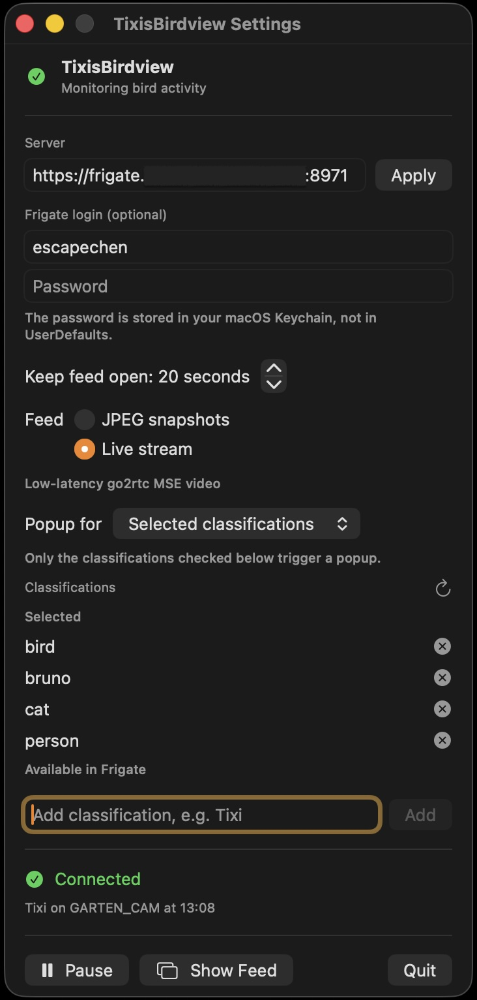

# TixisBirdview

TixisBirdview is a small macOS menu-bar app compatible with
[Frigate NVR](https://github.com/blakeblackshear/frigate). It requires a
running Frigate installation; when Frigate detects something you care
about—such as a person, pet, or named animal—it opens a temporary camera feed
above your work without taking keyboard focus.

> TixisBirdview is an independent application compatible with Frigate. It is not
> affiliated with or endorsed by Frigate, Inc.

Built by [Marcel Kühn](AUTHORS.md) with OpenAI Codex (GPT-5.6 Terra, Extra
High reasoning).



## What it does

- Watches recent Frigate events and review activity every two seconds.
- Opens a movable, timed feed for selected classifications, for example
  `person`, `cat`, or `Tixi`.
- Shows the detected label, confidence, camera, a countdown, and either JPEG
  snapshots or a low-latency go2rtc live stream.
- Offers optional popup sound alerts with a selectable macOS sound and volume,
  plus independent popup and sound cooldowns.
- Keeps the password in the macOS Keychain and uses normal TLS certificate
  validation.
- Remembers the feed's width and display position, then adapts its height to
  each camera's aspect ratio. The feed does not take focus from the app you
  are using.



## Install from source — no Swift knowledge required

There is no signed or notarized package yet. Publishing one requires a paid
Apple Developer Program membership, so the free option today is to build the
app on your own Mac with a free Apple Account.

The process is deliberately simple: install Xcode once, follow the
[source-build guide](docs/BUILD_FROM_SOURCE.md), then run:

```sh
./build-and-install.sh
```

The script builds TixisBirdview and installs it in `/Applications`. No Swift
knowledge is needed.

## What you need

- A Mac running a current macOS version.
- A reachable [Frigate NVR](https://github.com/blakeblackshear/frigate) server.
  Use the full base URL, including `https://` and a non-standard port if
  applicable—for example `https://frigate.example.net:8971`.
- A certificate macOS trusts. TixisBirdview deliberately does not bypass TLS
  warnings.
- Frigate credentials only if your Frigate installation requires login.

For **Live stream**, the selected camera also needs a working Frigate/go2rtc
live restream with a codec WebKit can play. **JPEG snapshots** are the most
compatible choice and remain available if live video is unavailable.

## First-time setup

Open the  icon in the menu bar, then choose **Settings**.



1. Enter the Frigate server URL and choose **Apply**.
2. If Frigate uses login, enter the username and password. The password goes
   into your macOS Keychain; it is not written to TixisBirdview's preferences.
3. Set **Keep feed open** to the number of seconds you want the popup visible.
4. Optionally enable **Popup cooldown** and/or **Sound cooldown**, then enter
   the number of seconds to suppress each type of repeated automatic alert.
   Manual **Show Feed** remains immediate.
5. Optionally enable **Sound alert**, select a sound, set its volume, and use
   **Preview** to test it.
6. Choose a feed mode:
   - **JPEG snapshots**: reliable, updated twice per second.
   - **Live stream**: lower latency go2rtc video when the camera supports it.
7. Choose **Popup for**:
   - **Selected classifications**: only selected names open a feed.
   - **Any tracked object**: every Frigate object event opens a feed.
8. Add the names you want. Use the refresh icon, then **Choose…**, to select
   one or more labels and sub-labels Frigate has already seen. You can always
   add a custom value such as `Tixi` yourself.

Names are matched against Frigate's event label and sub-label. They are not
case-sensitive in normal Frigate configurations, but using the spelling shown
by Frigate is best.

## Using the feed

- Click the image to dismiss it early.
- The countdown in the lower-right shows when it will disappear automatically.
- Drag the **hand** control in the lower-right to move the window.
- Click the diagonal-arrows control to enlarge or restore its size.
- The window remembers its width and display position; its height follows the
  current camera's aspect ratio. If the old display is gone, it falls back to
  the main display.

## Important Frigate distinction

Birdseye's **continuous**, **motion**, and **objects** modes decide what
Frigate draws in its Birdseye mosaic. They do not create a TixisBirdview popup
by themselves. TixisBirdview reacts to new Frigate event/review records and
filters them by their object classification.

## Troubleshooting

| Problem | What to check |
| --- | --- |
| Menu-bar icon is red | Confirm the URL, Frigate availability, macOS TLS trust, and login details. TixisBirdview shows a short connection-lost/restored message when the state changes. |
| No popup | Make sure monitoring is not paused. Temporarily select **Any tracked object**, then check the status line for the last activity Frigate sent. |
| A name never triggers | Add the exact event label or sub-label shown in Frigate. A Birdseye image without a new event does not count. |
| Live stream is black or frozen | Confirm the camera plays in Frigate and has a compatible go2rtc restream; use **JPEG snapshots** as the immediate fallback. |
| Feed is on the wrong screen | Drag it once to the intended display. Its position is saved. |

## Build from source

Anyone can build TixisBirdview from this repository using Xcode and the included
script; no Swift knowledge is required. Follow the
[step-by-step source-build guide](docs/BUILD_FROM_SOURCE.md).

## For maintainers

- [Release and signing guide](docs/RELEASING.md)
- [Changelog](CHANGELOG.md)
- [Keeping GitHub and Gitea in sync](docs/GIT_MIRRORS.md)
- [Third-party notices](THIRD_PARTY_NOTICES.md)
- [Contributors](AUTHORS.md)
- `FrigateMonitor.swift`: Frigate login, Keychain storage, polling, filters,
  and stream lookup.
- `VideoFeedView.swift`: popup UI, JPEG refresh, countdown, and feed controls.
- `FrigateMSEStreamView.swift`: authenticated go2rtc MSE live playback.
- `OverlayWindowController.swift`: non-activating floating window and saved
  geometry.

TixisBirdview's own code is licensed under the [MIT License](LICENSE). Frigate-derived
MSE handling remains covered by the attribution in
[THIRD_PARTY_NOTICES.md](THIRD_PARTY_NOTICES.md).
