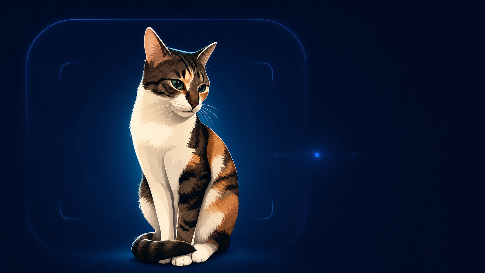
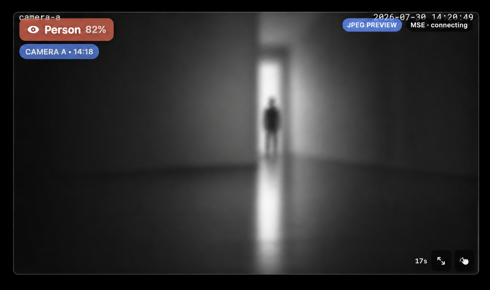
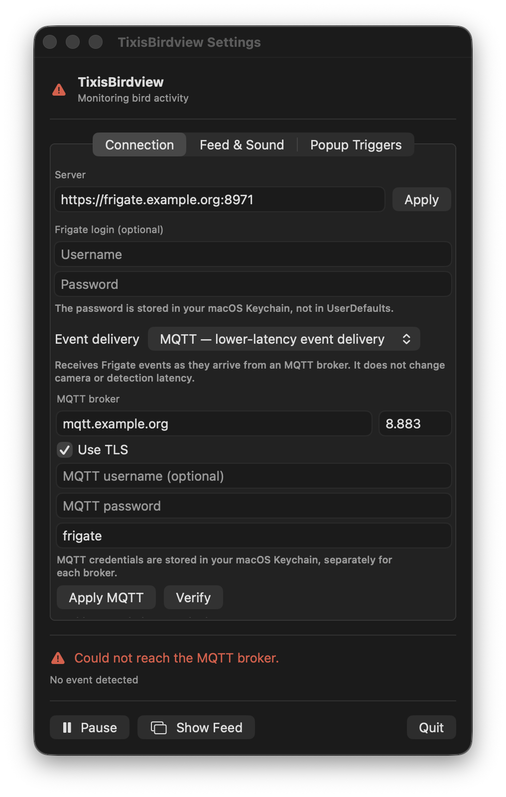
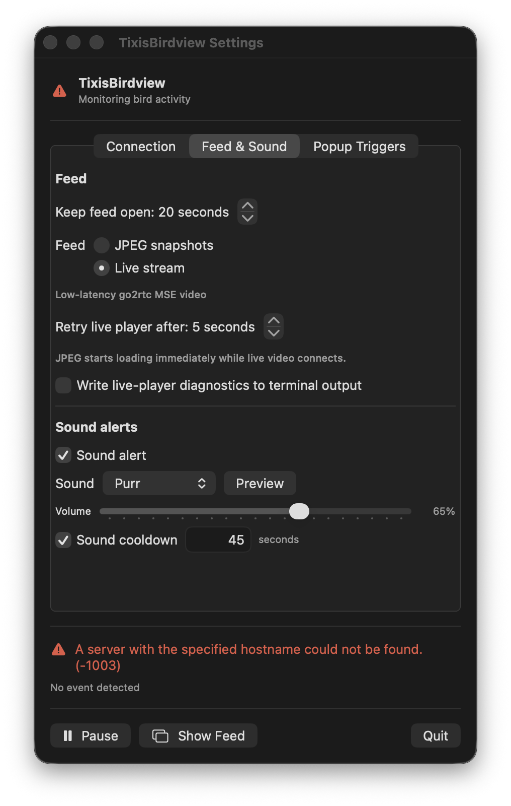
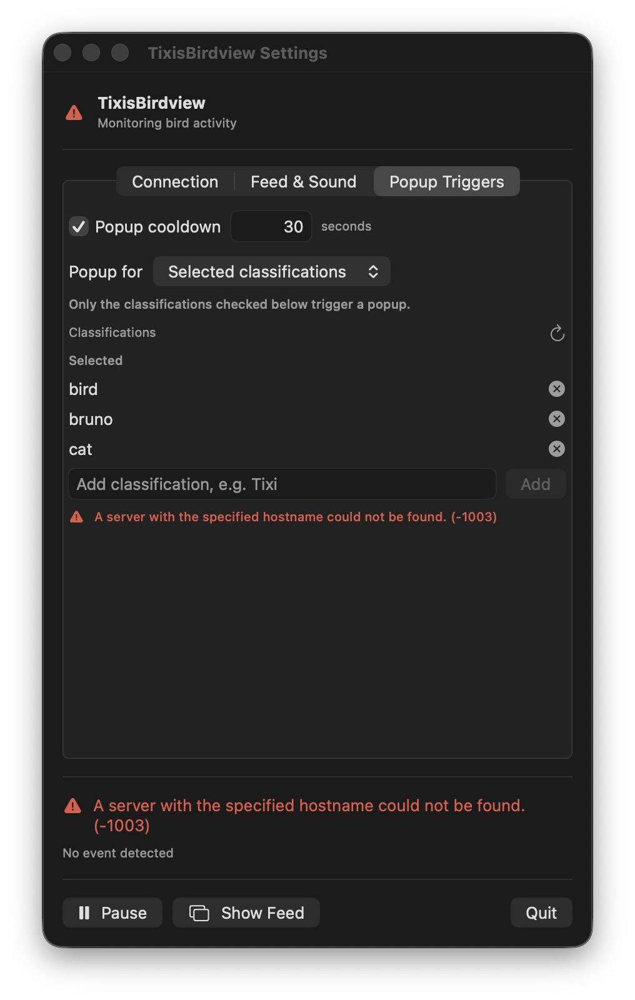

# TixisBirdview

TixisBirdview is a small macOS menu-bar app compatible with
[Frigate NVR](https://github.com/blakeblackshear/frigate). It requires a
running Frigate installation; when Frigate detects something you care
about—such as a person, pet, or named animal—it opens a temporary camera feed
above your work without taking keyboard focus.

> TixisBirdview is an independent application compatible with Frigate. It is not
> affiliated with or endorsed by Frigate, Inc.

Built by [Marcel Kühn](AUTHORS.md) with OpenAI Codex (GPT-5.6 Terra, Extra
High reasoning).

<p align="center">
  
</p>

## What it does

- Checks Frigate events and review activity every two seconds by HTTP, or can
  receive them immediately from its MQTT broker.
- Opens a movable, timed feed for selected classifications, for example
  `person`, `cat`, or `Tixi`.
- Shows the detected label, confidence, camera, a countdown, and either JPEG
  snapshots or a low-latency go2rtc live stream.
- Offers optional popup sound alerts with a selectable macOS sound and volume,
  plus independent popup and sound cooldowns.
- Keeps the password in the macOS Keychain and uses normal TLS certificate
  validation. Frigate passwords are isolated by server and username.
- Remembers the feed's width and display position, then adapts its height to
  each camera's aspect ratio. The feed does not take focus from the app you
  are using.
- Checks GitHub Releases at most once per day and shows one non-activating
  menu-bar notice when a newer stable version is available. Updates are never
  downloaded or installed silently.

## Activity popup

The popup shows why it opened, the relevant camera, the current feed mode, and
the remaining display time. This privacy-safe rendering preserves the real
window UI while using a blurred synthetic scene and non-identifiable figure.



## Install — no Xcode required

Download the signed and Apple-notarized DMG from the
[latest GitHub release](https://github.com/escapechen/TixisBirdview/releases/latest).
The current release is **1.1.0 (build 2)** and supports both Apple Silicon and
Intel Macs. Users do not need Xcode, an Apple Developer membership, or any
Swift knowledge.

1. Download `TixisBirdview-1.1.0-2.dmg`.
2. Open the DMG and drag **TixisBirdview** onto its **Applications** shortcut.
3. Open TixisBirdview from `/Applications`. macOS may show its normal first-run
   confirmation for an app downloaded from the internet.

The release also includes `TixisBirdview-1.1.0-2.dmg.sha256`. To verify the
download, keep both files in the same directory and run:

```sh
shasum -a 256 -c TixisBirdview-1.1.0-2.dmg.sha256
```

Building from source remains available for contributors and anyone who wants
to inspect or modify the app.

## What you need

- An Intel or Apple Silicon Mac running macOS 14 Sonoma or newer.
- A reachable [Frigate NVR](https://github.com/blakeblackshear/frigate) server.
  Use the full base URL, including `https://` and a non-standard port if
  applicable—for example `https://frigate.example.net:8971`. If you omit the
  scheme, TixisBirdview assumes HTTPS.
- A certificate macOS trusts. TixisBirdview deliberately does not bypass TLS
  warnings.
- Frigate credentials only if your Frigate installation requires login.

For **Live stream**, the selected camera also needs a working Frigate/go2rtc
live restream with a codec WebKit can play. **JPEG snapshots** are the most
compatible choice and remain available if live video is unavailable.

## First-time setup

Open the  icon in the menu bar, then choose **Settings**.

Settings are grouped into four native toolbar panes. **General** contains Dock
and software-update preferences; the three setup-specific panes shown below
use only example addresses and no real credentials.

<p align="center">
  
  
  
</p>

1. On **General**, choose whether TixisBirdview appears in the Dock and whether
   it checks GitHub Releases automatically. **Check Now** performs an immediate
   check; TixisBirdview only opens a release page when you ask it to.
2. On **Connection**, enter the Frigate server URL and choose **Apply**. If
   Frigate uses login, enter its username and password. The password goes into
   your macOS Keychain under that server and username; it is not written to
   TixisBirdview's preferences. Explicit HTTP connections show a warning and
   require confirmation because credentials and camera data are unencrypted.
3. Under **Event delivery**, keep **HTTP polling** for the compatible default,
   or choose **MQTT** for faster event delivery. For MQTT, enter the broker
   host, port, TLS choice, optional credentials, and Frigate topic prefix
   (normally `frigate`), then choose **Apply MQTT** and **Verify**. MQTT
   credentials are stored separately in the macOS Keychain. Disabling TLS
   displays a warning and requires confirmation.
4. On **Feed & Sound**, set **Keep feed open** to the number of seconds you
   want the popup visible, then choose a feed mode:
   - **JPEG snapshots**: reliable, updated twice per second.
   - **Live stream**: lower latency go2rtc video when the camera supports it.
   When using **Live stream**, choose **Retry live player after** (1–15
   seconds). TixisBirdview starts JPEG immediately and keeps it visible while
   the MSE player connects or retries in the background. It switches to video
   only after a decoded frame arrives. The default is 5 seconds; use a shorter
   time for doorbell-like feeds or increase it for a camera with a slow
   key-frame interval. Enable **Write live-player diagnostics to terminal
   output** when troubleshooting; its concise state lines intentionally omit
   server addresses, camera names, credentials, cookies, and tokens. The muted
   WebKit player starts with video-only negotiation and does not seek or
   accelerate the live playhead. If go2rtc supplies only an initializer, it
   retries with Frigate's standard codec negotiation; an excessively delayed
   player is rebuilt cleanly.
5. Still on **Feed & Sound**, optionally enable **Sound alert**, select a
   sound, set its volume, and use **Preview** to test it. **Sound cooldown**
   appears once sound is enabled and suppresses repeated automatic sounds.
6. On **Popup Triggers**, optionally enable **Popup cooldown** to suppress
   repeated automatic popups. Manual **Show Feed** remains immediate. Choose
   **Popup for**:
   - **Selected classifications**: only selected names open a feed.
   - **Any tracked object**: every Frigate object event opens a feed.
7. Add the names you want. Use the refresh icon, then **Choose…**, to select
   one or more labels and sub-labels Frigate has already seen. You can always
   add a custom value such as `Tixi` yourself.

Names are matched against Frigate's event label and sub-label. They are not
case-sensitive in normal Frigate configurations, but using the spelling shown
by Frigate is best.

## Using the feed

- If macOS hides the menu-bar icon on a smaller or crowded screen, right-click
  or long-press the TixisBirdview Dock icon for status, monitoring, feed,
  duration, Settings, update, and About commands. A normal Dock click opens
  Settings.
- Click the image to dismiss it early.
- The countdown in the lower-right shows when it will disappear automatically.
- Drag the **hand** control in the lower-right to move the window.
- Click the diagonal-arrows control to enlarge or restore its size.
- The window remembers its width and display position; its height follows the
  current camera's aspect ratio. If the old display is gone, it falls back to
  the main display.

## Important Frigate distinction

Birdseye's **continuous**, **motion**, and **objects** modes decide what
Frigate draws in its Birdseye mosaic. They do not create a TixisBirdview popup
by themselves. TixisBirdview reacts to new Frigate event/review records and
filters them by their object classification.

## Troubleshooting

| Problem | What to check |
| --- | --- |
| Menu-bar icon is red | Confirm the URL, Frigate availability, macOS TLS trust, and login details. When using MQTT, also check the Connection pane's delivery status and broker settings. TixisBirdview shows a short connection-lost/restored message when the state changes. |
| No popup | Make sure monitoring is not paused. Temporarily select **Any tracked object**, then check the status line for the last activity Frigate sent. With MQTT selected, use **Verify** in the Connection tab first. |
| A name never triggers | Add the exact event label or sub-label shown in Frigate. A Birdseye image without a new event does not count. |
| Live stream is black or frozen | Confirm the camera plays in Frigate and has a compatible go2rtc restream. JPEG is loaded immediately while MSE keeps connecting in the background; reduce **Retry live player after** to retry sooner. |
| Feed is on the wrong screen | Drag it once to the intended display. Its position is saved. |
| Update check fails | Confirm the Mac can reach `api.github.com`. No Frigate or MQTT settings are included in update requests. |

## Build from source

This is optional for normal users. Contributors can build TixisBirdview using
Xcode and the included script; no Swift knowledge is required. Follow the
[step-by-step source-build guide](docs/BUILD_FROM_SOURCE.md).

## For maintainers

- [Release-readiness TODO](TODO.md)
- [Release and signing guide](docs/RELEASING.md)
- [Changelog](CHANGELOG.md)
- [Keeping GitHub and Gitea in sync](docs/GIT_MIRRORS.md)
- [Third-party notices](THIRD_PARTY_NOTICES.md)
- [Privacy](PRIVACY.md)
- [Security policy](SECURITY.md)
- [Contributors](AUTHORS.md)
- `FrigateMonitor.swift`: Frigate login, Keychain storage, polling, filters,
  and stream lookup.
- `VideoFeedView.swift`: popup UI, JPEG refresh, countdown, and feed controls.
- `FrigateMSEStreamView.swift`: authenticated go2rtc MSE live playback.
- `OverlayWindowController.swift`: non-activating floating window and saved
  geometry.

Release versions use semantic `MAJOR.MINOR.PATCH` numbering; the independent
integer build number increases for every distributed build. The current source
is **1.1.0 (build 2)**. Maintainers can validate both values and the changelog
with `./scripts/check-versioning.sh`.

Before contributing, run `./scripts/install-git-hooks.sh` once. The hook and
local release checks reject signing Team IDs, Developer ID selections, private
key/profile files, private service addresses, access tokens, and
machine-specific home paths. Signing keys and notarization credentials belong
only in macOS Keychain; local selection files are ignored by Git.

TixisBirdview's own code is licensed under the [MIT License](LICENSE). Frigate-derived
MSE handling remains covered by the attribution in
[THIRD_PARTY_NOTICES.md](THIRD_PARTY_NOTICES.md).
